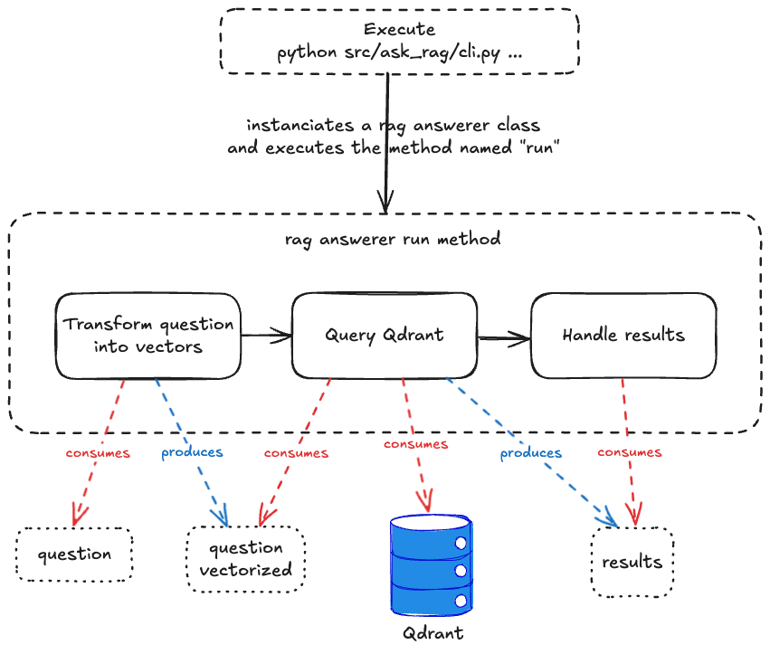

# Ask rag


## I. Command
- Generic command :
```bash
python src/ask_rag/cli.py \
    --rag-answerer-name <rag_answerer_name> \
    --question "<question>" \
    --collection-name <collection_name> \
    [--limit <limit>]
    [--score-threshold <score_threshold>]
```

- Example :
```bash
python src/cli/ask_rag/cli.py \
    --rag-answerer-name 'base' \
    --question "Qu'est que la grâce ?" \
    --collection-name somme_theologique \
    --limit 5 \
    --score-threshold 0.7
```

- Paramter :
  - `rag_answerer_name`: name of the `RagAnswerer` to use (cf [rag_answerer_name_to_class.py](rag_answerer_name_to_class.py)) 
  - `question` : question to ask
  - `collection_name` : name of the collection in Qdrant where the vectors are stored
  - `limit` : maximum number of results to return (optional, default is 3)
  - `score_threshold` : minimum score to return a result (optional, default is 0.5)


## II. How it works


Steps :
1. Transform the question into vectors
2. Query Qdrant. Quadrant returns : 
    - the corresponding chunks
    - the similarity score
3. Handle the results
    - for example, in base the result chunks and the score is printed on the console

Note : In future version, we will enrich the results with LLMs (Large Language Models) to generate more complete answers.


## III. Implement your own `RagAnswerer`:
1. Create a file in `src/ask_rag/rag_answerers/`
2. Implement in this file the new class (inherits from `RagAnswerer`)
3. Add the class in the file [rag_answerer_name_to_class.py](rag_answerer_name_to_class.py)
4. Launch the python command with `rag_answerer_name` set to the "name" of your class
