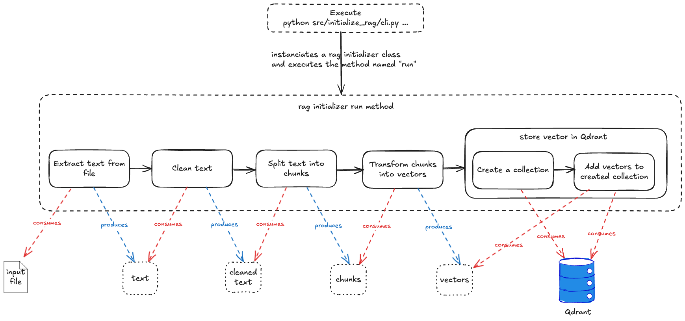

# Initialize RAG


## I. Command
1/ Lauch Qdrant : `docker-compose up -d`

2/ Execute initialization script :

- Generic command : 
```bash
python -m src.initialize_rag.cli \
    --rag-initializer-name <rag_initializer_name> \
    --file-path <file_path> \
    --collection-name <collection_name>` \
    [--overwrite-collection]
```

- Example : 
```bash
python -m src.initialize_rag.cli \
    --rag-initializer-name 'from_pdf' \
    --file-path files/somme_theologique_72a102.pdf \
    --collection-name somme_theologique
```

- Parameters :
  - `rag_initializer_name`: name of the `RagInitializer` to use (cf [rag_initializer_name_to_class.py](rag_initializer_name_to_class.py))
  - `file_path` : path to the file to index
  - `collection_name` : name of the collection in Qdrant where the vectors will be stored
  - `overwrite_collection` : if the collection already exists, it will be overwritten (optional, default is `False`)


## II. How it works


Steps :
1. Extract text from the file
2. Clean the text (if needed)
3. Split the text into chunks
4. Transform the chunks into vectors
5. Store the vectors in Qdrant
   1. Create the collection if it does not exist
   2. Add the vectors to the collection


## III. Implement your own `RagInitializer` :
1. Create a file in `src/initialize_rag/rag_initializers/`
2. Implement in this file the new class (inherits from `RagInitializer`)
3. Add the class in the file [rag_initializer_name_to_class.py](rag_initializer_name_to_class.py)
4. Launch the python command with `rag_initializer_name` set to the "name" of your class
